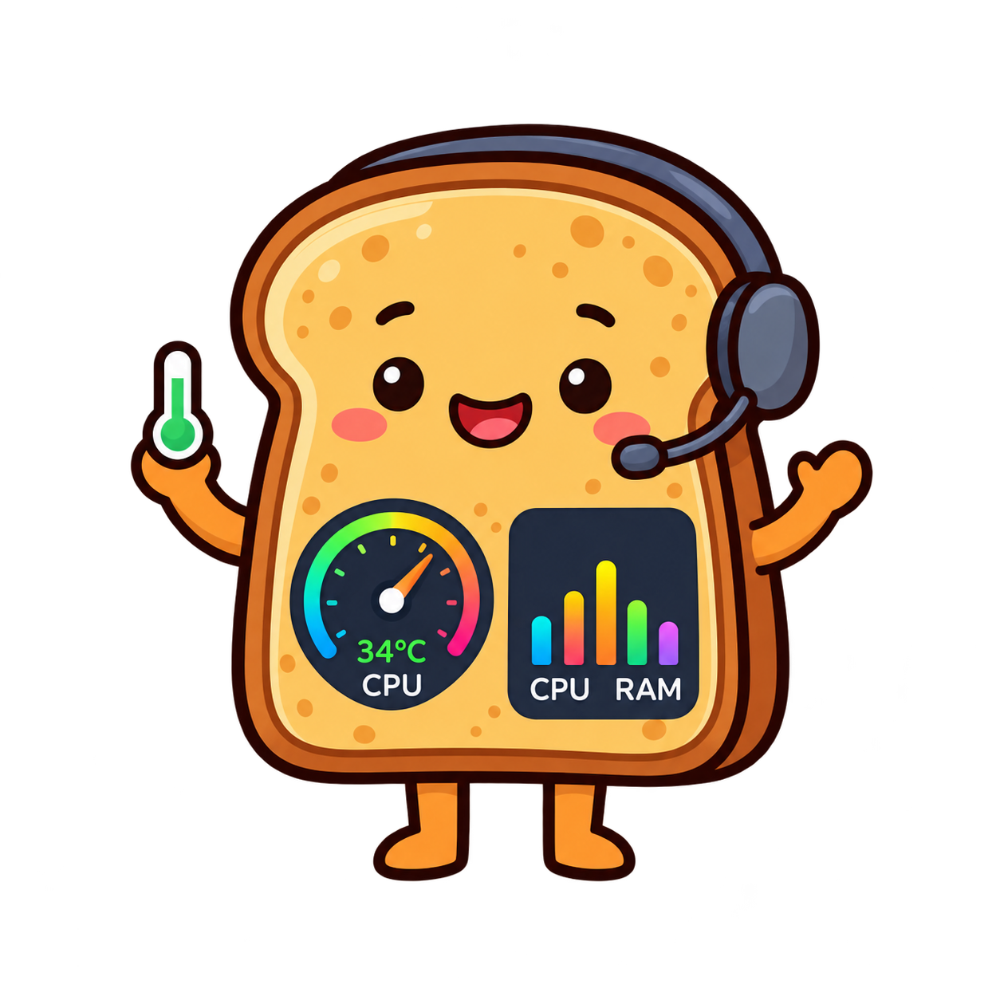

<p align="center">
  
</p>

<h1 align="center">Toasty🔥</h1>

<p align="center">
  Your PC's temperatures and load, at a glance, right in the Windows system tray with a handy pop-out metric panel.<br>
  Free and open source (MIT). No accounts, no telemetry, never goes online.
</p>

<p align="center">
  <a href="https://github.com/brundyy/toasty/releases/latest"><b>Download the latest release</b></a>
</p>

---

Toasty puts small, colour-coded numbers in your system tray for CPU temperature, CPU usage, GPU temperature, GPU usage and RAM usage. Cyan is cold, green is fine, then yellow, orange and red as things heat up. Click any of them for a panel with live graphs, per-core detail, every sensor your hardware exposes, and a history of your game sessions with an FPS and bottleneck breakdown.

## Features

- **Tray icons** for CPU and GPU temperature and usage, RAM usage, and optionally GPU hotspot and memory junction. Six styles: label + number, number only, number + level bar, label + level bar, meter, or a plain colour dot. Pick a default and override any icon.
- **Colour bands you control.** Five bands per metric with your own thresholds and colours, plus smoothing so the numbers don't jitter and the colours don't flicker on a boundary.
- **Pop-up panel** with two-minute graphs and session peaks, per-core load / clock / power, GPU hotspot, memory junction, VRAM, power and fan, memory details (cached, committed, module speed, DIMM temperatures where supported), and an **All sensors** view of everything your motherboard, drives and chips report.
- **Detach the panel** with the pin (or by dragging its header) to keep it open on another screen. It remembers where you left it, and its height is adjustable.
- **Game sessions.** Games are detected automatically (Steam, Epic, GOG, EA, Ubisoft, Xbox and more) and recorded while they're in front: highs, lows and averages for every sensor, plus average FPS, 1% and 0.1% lows, frame times and stutters. Each session gets a verdict (GPU-bound, CPU-bound, capped or mixed) worked out from per-frame CPU and GPU busy time, with plain-English hints about stutter, VRAM, RAM, heat and power-supply headroom.
- **Alerts** when a reading stays above a limit for a while (for example CPU at 85°C for 30 seconds). Brief spikes are ignored.
- **Power vs your PSU.** USB-connected power supplies (Corsair HXi / RMi / AXi and similar) are detected and report real measured power; for others, enter the wattage and Toasty estimates the draw.
- **Settings live in the panel** and apply instantly. Retention and disk-space limits for game sessions are up to you.

## Install

1. Download `Toasty-Setup-<version>.exe` from [Releases](https://github.com/brundyy/toasty/releases/latest).
2. Run it. The first page lists exactly what gets installed and why (summarised below).
3. Windows 11 hides new tray icons: go to **Settings > Personalization > Taskbar > Other system tray icons** and switch on the Toasty entries.

The installer isn't code-signed yet, so Windows SmartScreen may say "Windows protected your PC". Click **More info > Run anyway**. Every release's source is here, so you can build it yourself if you prefer.

**Requirements:** Windows 10 (1809) or Windows 11, 64-bit. Nothing else; the .NET runtime is built in.

### What the installer puts on your PC

| Component | What it's for |
|---|---|
| **Toasty** | The app itself, with the .NET runtime built in. Runs as administrator, because reading temperatures needs low-level hardware access. |
| **PawnIO driver** *(optional checkbox)* | A small, signed driver that lets apps read CPU temperature and power safely; the modern replacement for WinRing0, which Windows Defender now blocks. It's shared with other monitoring tools and stays installed if you uninstall Toasty. Without it, CPU temperature shows as "-". |
| **PresentMon** by Intel | Measures FPS and frame times, only while a game is being recorded. It reads frame events Windows already publishes and doesn't inject into games. Can be switched off in Settings. |

"Start Toasty when I sign in" uses a scheduled task, so there's no UAC prompt at every login. Uninstalling removes Toasty and its startup task; your settings and sessions in `%AppData%\Toasty` are kept.

## Privacy

Toasty makes no network connections at all. Settings and game sessions are stored only on your PC in `%AppData%\Toasty`, and you choose how long sessions are kept and how much disk they may use. Errors, if any, are written to `%AppData%\Toasty\error.log`, which never leaves your PC.

## FAQ

**Does PresentMon trip anti-cheat?** It reads frame timing events that Windows already publishes (the same approach tools like CapFrameX use) and doesn't touch the game process. If a game ever complains, turn off *Capture FPS* in Settings > Game sessions; you'll still get sensor-based sessions.

**Why does Toasty need admin rights?** CPU temperature, power and some memory sensors can only be read with low-level hardware access, which Windows reserves for administrators.

**A game wasn't detected.** The Games tab shows what Toasty saw last and why it did or didn't count it. Use **Record now**, or add the game's exe to *Always treat as games* in Settings.

## Build from source

Requires the [.NET 10 SDK](https://dotnet.microsoft.com/download). Everything else is fetched by the build script, pinned to exact versions and hash-checked.

```powershell
.\build-installer.ps1
```

This publishes a self-contained `publish\Toasty.exe`, downloads PawnIO 2.2.0 and PresentMon 2.6.0, fetches Inno Setup from its NuGet package into `installer\tools` (nothing is installed on your machine), and writes `dist\Toasty-Setup-<version>.exe` along with `dist\PawnIO-2.2.0-source.zip`.

To release: bump `<Version>` in `Toasty.csproj`, run the script, and attach both files from `dist\` to a GitHub release (the PawnIO source zip is required by its GPL licence). If you change the logo, regenerate the icon with `.\tools\make-icon.ps1`.

## Credits

Toasty stands on some excellent open-source work, all used unmodified:

- [LibreHardwareMonitor](https://github.com/LibreHardwareMonitor/LibreHardwareMonitor) for hardware sensors (MPL-2.0)
- [PresentMon](https://github.com/GameTechDev/PresentMon) by Intel for frame timing (MIT)
- [PawnIO](https://github.com/namazso/PawnIO) by namazso, the signed driver that lets CPU sensors be read (GPL-2.0; matching source is attached to each release)
- [HidSharp](https://software.seekye.com/hidsharp) (Apache-2.0) and Blacktempel's DiskInfoToolkit / RAMSPDToolkit / BlackSharp (MPL-2.0), via LibreHardwareMonitor
- The .NET runtime (MIT), bundled so nothing else needs installing

Full details, copyright notices and source links are in [THIRD-PARTY-NOTICES.md](THIRD-PARTY-NOTICES.md); licence texts are in [`licenses/`](licenses).

## Licence

Toasty is released under the [MIT licence](LICENSE). Third-party components keep their own licences, listed above.
